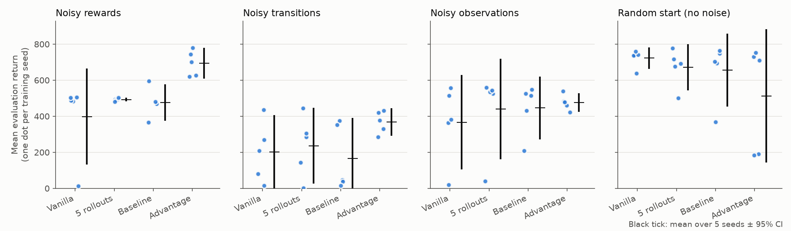
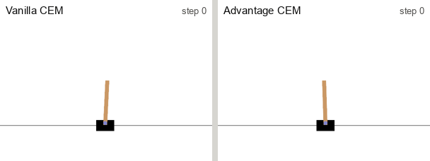

# Cross-Entropy Method under noise: adapting CEM to stochastic environments

> Individual course project · *IE540 Dynamic Programming and Reinforcement Learning* · KAIST (exchange year), Spring 2025 · Python, PyTorch, Gymnasium, NumPy

The Cross-Entropy Method (CEM) is usually presented as an efficient policy-search method for deterministic environments. In this project, I wanted to see how it handles stochastic environments, where the return of a policy varies from one episode to the next.

CEM samples many policies, keeps the best 20% (the "elites") according to their return, and refits its sampling distribution to them. If each policy is scored on a single episode with a noisy return, some elites are policies that were only lucky in that episode, and the algorithm can struggle to converge. The same problem appears whenever the best of many candidates is chosen from noisy scores, for example when selecting a model on a small validation set or picking the winner of an A/B test with many variants.

To study this, I built four CartPole environments with different types of noise and compared vanilla CEM with three variants that score policies differently. Scoring policies by their advantage gave the best results with noisy rewards (a mean return of 694 against 398 for vanilla CEM) and avoided the collapsed training runs that vanilla CEM had in each noisy environment. In the other settings, most differences were within the confidence intervals, and without noise during the episode vanilla CEM did best.

## Environments

My implementation is based on the continuous CartPole environment from the course's Homework 5. The action is continuous in [−1, 1] (scaled to a force of ±10 N), episodes last at most 500 steps, and the per-step reward is `1 + 10·|θ| + 0.3·|ẋ|`, so returns can exceed 500. I made four environments, each adding zero-mean Gaussian noise in a different place:

| `--env` | What is noisy | Std. dev. | What it represents |
|---|---|---|---|
| `obs` | State seen by the agent (true dynamics unchanged) | 0.3 | Imperfect sensors |
| `reward` | Reward signal | 5.0 | Noisy measurement of the outcome |
| `transition` | Action, before it is applied | 1.0 | Physical or mechanical perturbations |
| `start` | Initial state only | – | Varying starting conditions |

## Agents

The policy is linear, `a = tanh(w·s + b)`, with 5 parameters. Each generation, CEM samples 100 parameter vectors from N(μ, σ²), scores them, and refits μ and σ to the top 20%. Training lasts 50 generations, and the policy kept at the end is the best-scoring candidate. Vanilla CEM scores each candidate by its return on one episode. I compared it with three other ways of scoring:

1. **Several rollouts** (`--agent cem --rollouts 5`): the score is the average return over 5 episodes. This is the simplest idea and directly reduces the variance of the score, but it needs 5 times more simulation, so it becomes expensive for larger problems. This is why I also looked at the two other ideas.
2. **Advantage** (`--agent advantage`): the score is the mean advantage A(s,a) = G_t − V(s_t) along the episode, where V is a small neural network trained on the returns seen so far. The advantage measures how much better an action was than expected in that state, so it depends on the actions the policy chose more than on lucky states or rewards.
3. **Baseline** (`--agent baseline`): a simpler version of the advantage idea, where a single baseline replaces V(s). The score is the return minus an exponential moving average of previous returns.

Each trained policy is evaluated on 300 episodes. Rewards from the first 100 steps are discarded, so an episode that fails early scores 0. Every configuration is trained with 5 seeds.

## Results

The table shows the mean evaluation return over the 5 training seeds, with a 95% confidence interval across seeds.

| Noise | Vanilla | 5 rollouts | Baseline | Advantage |
|---|---|---|---|---|
| Noisy rewards | 398 [131, 666] | 492 [483, 502] | 476 [376, 576] | 694 [608, 781] |
| Noisy transitions | 201 [−3, 406] | 236 [27, 446] | 165 [−60, 390] | 369 [293, 445] |
| Noisy observations | 367 [105, 629] | 441 [162, 719] | 446 [272, 620] | 476 [424, 529] |
| Random start (no noise) | 723 [663, 783] | 672 [544, 800] | 656 [453, 858] | 513 [143, 883] |

<br>
<sub><i>Each dot is one training seed (mean return over 300 evaluation episodes). The black ticks show the mean over the 5 seeds and its 95% confidence interval.</i></sub>

- **Noisy rewards.** The advantage score gives the best results. It improves on vanilla CEM by 296 on average (paired 95% CI [+10, +582]), and all 5 Advantage seeds (621–779) score higher than all 5 vanilla seeds (14–505). Noise is still present in the advantage, but V(s) provides a stable reference, which reduces its relative effect.
- **Reliability under noise.** In each of the three noisy environments (rewards, transitions and observations), vanilla CEM had one training run that collapsed, with mean returns of 14, 15 and 19 respectively, because the search locked onto lucky policies early. The lowest Advantage seed in these environments was 285, which is why its confidence intervals are about 3 to 5 times narrower.
- **Noisy transitions.** This setting is difficult for every variant, and none averages above 400. Advantage is the best and the most consistent. 5 rollouts helps only slightly (+35 on average) for 5 times the simulation cost.
- **Noisy observations.** The differences between the variants are within the confidence intervals.
- **EMA baseline.** The baseline has no clear effect. This can be expected, because elites are selected by rank, and subtracting a baseline barely changes the ranking.
- **Random start.** Without noise during the episode, vanilla CEM is enough and the variants bring no gain. Advantage was the least stable in this setting, with 2 of 5 seeds collapsing.

## Example episode

The GIF shows a typical episode with noisy transitions. Vanilla CEM lets the cart drift off the track after 186 steps, and Advantage CEM keeps the pole up until step 300 (the maximum is 500).

<br>
<sub><i>Episodes chosen by a fixed rule: for each variant, the training seed with the median result, then the one of 300 new episodes whose return is closest to the median. An illustration, played in real time, generated by <code>scripts/make_gif.py</code>.</i></sub>

## Limitations

- **5 seeds per configuration.** Small differences are within the noise (see the intervals). Out of the 12 comparisons with vanilla CEM, only the advantage result with noisy rewards is convincing on its own.
- **Different start states in training and evaluation.** In the noisy environments, vanilla CEM and Baseline train from random starts, Advantage from the default start, and evaluation uses the default start. This may favour Advantage in the noisy environments, so its gains there should be read with this in mind. In the `start` environment, every phase uses random starts.
- **Small scope.** The experiments use one environment (CartPole), one noise level per type, and a linear policy with 5 parameters. Testing these methods on more complex problems, or combining them with more advanced versions of CEM such as CEM-RL, would be the next step.

## How to run

```bash
python -m venv .venv && source .venv/bin/activate
pip install -r requirements.txt

# one run: train (50 generations) then evaluate (300 episodes), ~10–60 s on a laptop CPU
python run.py --env reward --agent advantage --seed 0
python run.py --env transition --agent cem --rollouts 5 --seed 0

# full grid (4 noise types x 4 variants x 5 seeds = 80 runs, ~13 min), then the table and figure above
bash scripts/run_grid.sh
python scripts/summarize.py
```

The main options are `--env {plain,obs,reward,transition,start}`, `--agent {cem,baseline,advantage}`, `--rollouts N`, `--seed S`, `--mode {train,eval,both}` and `--noise SD`. Run `python run.py -h` for all options. Each run writes `checkpoints/<run>.pt` and `results/<run>_eval.json` (all 300 returns), together with training and evaluation plots.

## Repository structure

```
envs.py                       continuous CartPole and the 4 noisy variants
agents.py                     CEM, CEM + baseline, CEM + advantage
evaluate.py                   300-episode evaluation and plots
run.py                        command-line entry point (seeding, training, evaluation)
scripts/run_grid.sh           all 80 runs
scripts/summarize.py          results table, figure, summary/per_seed_returns.csv
scripts/make_gif.py           the GIF above (needs: pip install pygame pillow)
summary/per_seed_returns.csv  mean evaluation return of every run
figures/                      figure and GIF used in this README
```

## Context and 2026 cleanup

The continuous CartPole environment and the shaped reward come from the course's Homework 5 template. The research question, the noisy environments, the CEM variants and the experiments are my own. In 2026 I reorganized and documented the code for publication with [Claude Code](https://claude.com/claude-code) and reran the experiments with 5 seeds. The algorithms are unchanged.

I found few papers on CEM in stochastic settings, and these look at related but more complex problems: [arXiv:1609.09449](https://arxiv.org/abs/1609.09449), [arXiv:2008.06389](https://arxiv.org/abs/2008.06389), [arXiv:2009.09043](https://arxiv.org/abs/2009.09043).
